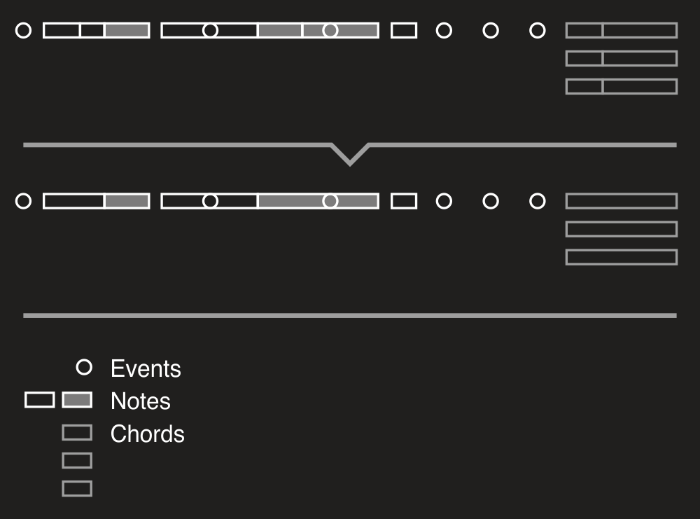
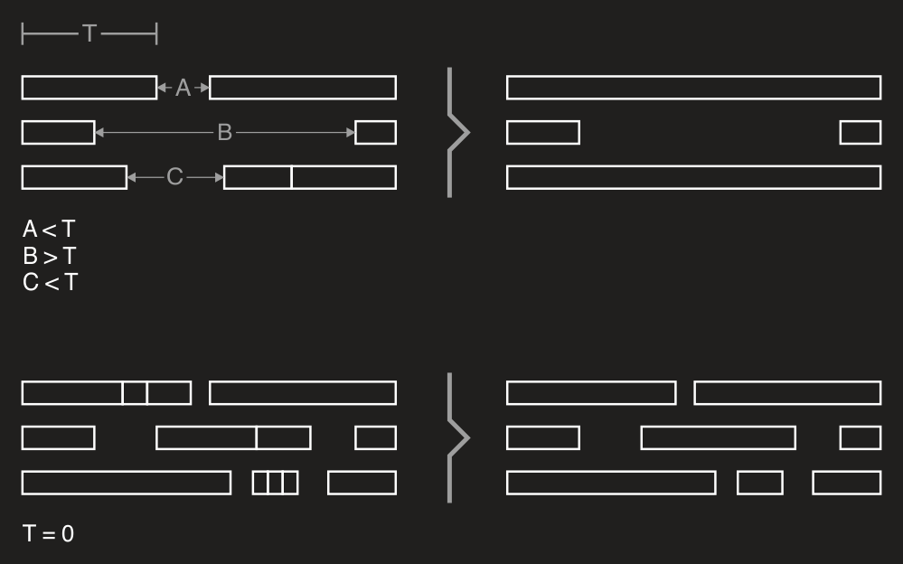

---
uid: a_obj_merging
---

# Objects merging

To merge nearby objects into one DryWetMIDI provides [Merger](xref:Melanchall.DryWetMidi.Tools.Merger) class. Quick example of merging in action:



Process of merging can be adjusted via [ObjectsMergingSettings](xref:Melanchall.DryWetMidi.Tools.ObjectsMergingSettings). By default two objects should have no gap between them to be merged. But you can specify any desired tolerance via settings:

```csharp
var newObjects = objects.MergeObjects(
    TempoMap.Default,
    new ObjectsMergingSettings
    {
        Tolerance = new MetricTimeSpan(0, 0, 1)
    });
```

Now objects will be merged if the distance between them from `0` to `1` second. So tolerance is maximum distance between two objects to consider them as nearby. Please take a look at how tolerance (`T`) affects process of merging:



Of course merging available not for objects collections only. You can use also [MergeObjects](xref:Melanchall.DryWetMidi.Tools.Merger.MergeObjects*) methods on [MidiFile](xref:Melanchall.DryWetMidi.Core.MidiFile) and [TrackChunk](xref:Melanchall.DryWetMidi.Core.TrackChunk):

```csharp
midiFile.MergeObjects(
    ObjectType.Note | ObjectType.Chord,
    new ObjectsMergingSettings
    {
        Filter = obj => obj.Time > 100
    },
    new ObjectDetectionSettings
    {
        ChordDetectionSettings = new ChordDetectionSettings
        {
            NotesMinCount = 3
        }
    });
```

The tool need to determine somehow whether two objects have the same "key" or not to take decision about merging them. For example, if we have a `C` note and `D` one, by default such notes are different in terms of their keys and thus won't be merged. To understand what the key is, please read [MIDI file splitting: SplitByObjects](xref:a_file_splitting#splitbyobjects) article.

Of course you can customize how objects are merged. For example, following picture shows how chords are merged using the default merging logic:


Now let's change the logic: chords can be merged only if there are notes in them without gap. Also notes in result chord need to start at the same time and have the same length. Following image shows how chords will be merged:


We need to derive from the [ObjectsMerger](xref:Melanchall.DryWetMidi.Tools.ObjectsMerger) class to implement these rules:

```csharp
private sealed class ChordsMerger : ObjectsMerger
{
    public ChordsMerger(ILengthedObject obj)
        : base(obj)
    { }

    public override bool CanAddObject(ILengthedObject obj, TempoMap tempoMap, ObjectsMergingSettings settings)
    {
        if (!base.CanAddObject(obj, tempoMap, settings))
            return false;

        var chordNotes = ((Chord)obj).Notes.ToArray();
        var lastChordNotes = ((Chord)_objects.Last()).Notes.ToArray();

        return Enumerable
            .Range(0, lastChordNotes.Length)
            .Any(i => lastChordNotes[i].EndTime == chordNotes[i].Time);
    }

    public override ILengthedObject MergeObjects(ObjectsMergingSettings settings)
    {
        var result = (Chord)base.MergeObjects(settings);
        var time = result.Time;
        var length = result.Length;

        foreach (var note in result.Notes)
        {
            note.Time = time;
            note.Length = length;
        }
        
        return result;
    }
}
```

And now we can merge objects using this class:

```csharp
midiFile.MergeObjects(
    ObjectType.Chord | ObjectType.Note,
    new ObjectsMergingSettings
    {
        ObjectsMergerFactory = obj => obj is Chord
            ? new ChordsMerger(obj)
            : new ObjectsMerger(obj)
    },
    new ObjectDetectionSettings
    {
        ChordDetectionSettings = new ChordDetectionSettings
        {
            NotesTolerance = 100
        }
    });
```

So if the tool encounters a chord, it uses our custom merger; for any other object's type – default one.